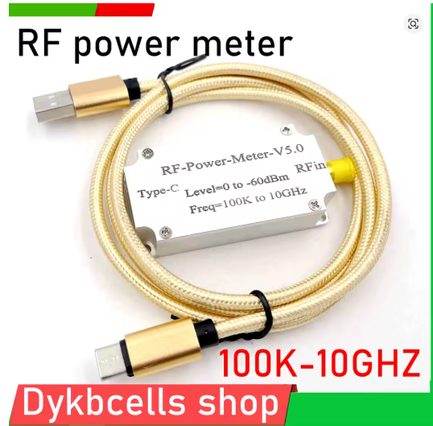
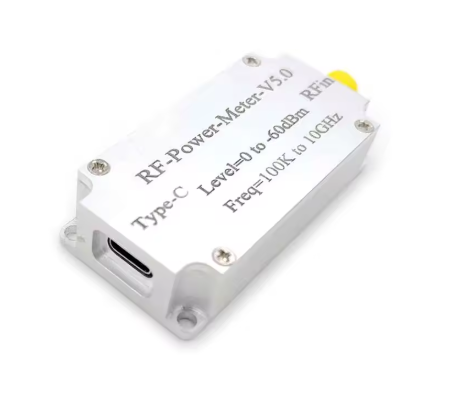
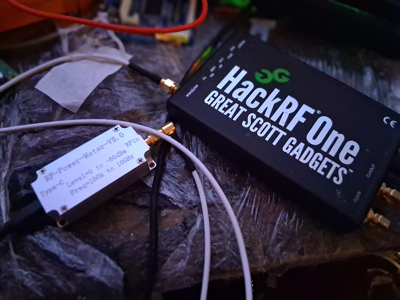
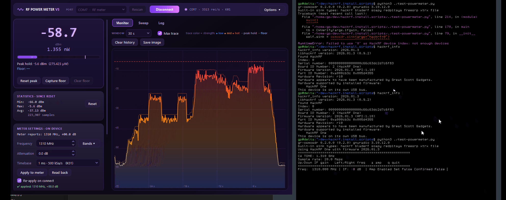
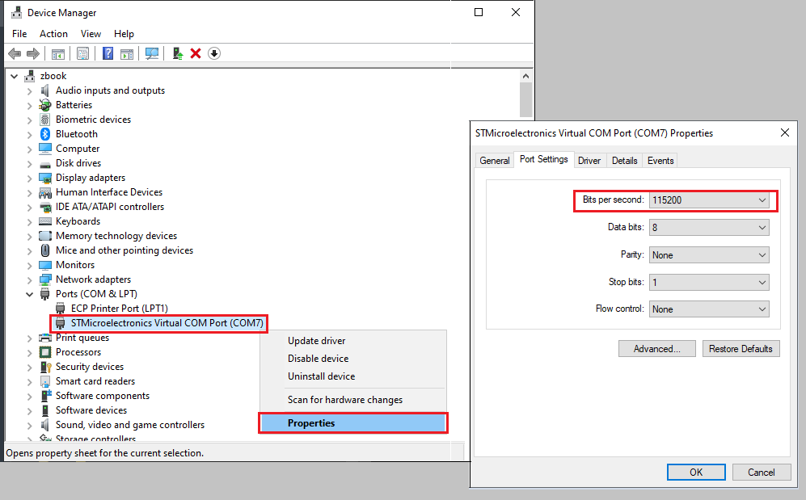
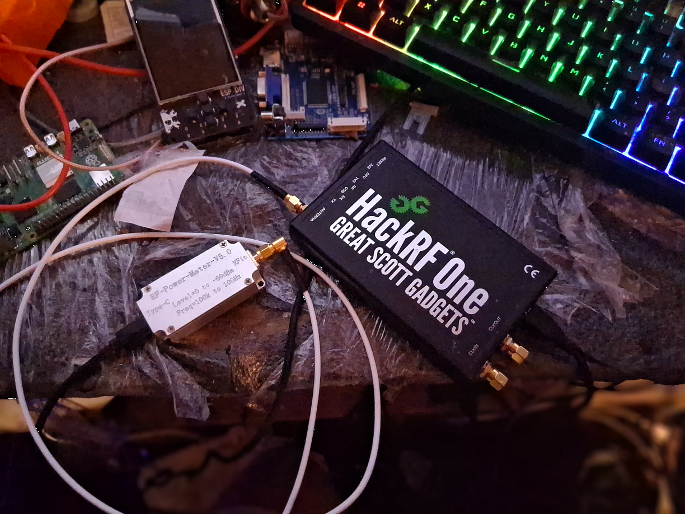

# RF Power Meter Assistant



Companion software for the cheap Chinese **USB RF Power Meter V5** (STM32 + AD8317/AD8318,
100 kHz – 10 GHz, about 0 to −60 dBm, USB-C, shows up as an ST virtual COM port `0483:5740`).



The vendor app is Windows-only and minimal. This repo has two replacements:

| | What | Platforms |
|---|---|---|
| [`qt/`](qt/) | **RF Power Meter Assistant**: the main app, C++17 / Qt 6 (or Qt 5.15) | Windows, Linux |
| [`powershell/`](powershell/) | A WinForms clone of the vendor app, plus serial capture helpers | Windows |



## Features (Qt app)

- **Live readout**: big dBm value, watts (auto-scaled pW → W), level bar, peak hold, noise-floor tare, over-range warning
- **Monitor tab**: rolling level chart from 10 s to 15 min, colored by strength, with max trace, peak-hold and floor lines, and a hover readout
- **Sweep tab**: oscilloscope-style view of one 500-sample sweep, markers M1/M2 (ΔT, 1/ΔT, ΔdB), Auto/Normal/Single trigger on a rising or falling edge, timebase K01..K18, CSV/PNG export
- **Meter settings**: band-calibration frequency and attenuation offset with band presets, verified by reading them back; optional re-apply on connect, because the meter forgets them on replug
- **Statistics**, **threshold events** (timestamped, debounced) and a **CSV logger** (20 rows/s)
- **Log tab** with every command sent, every reply and the last raw record
- **Demo mode**: a built-in simulated meter that speaks the real wire protocol, so you can try the UI without hardware
- Auto-connect and auto-reconnect when the meter is plugged back in

See [qt/README.md](qt/README.md) for the full feature list, mouse controls and keyboard shortcuts.

## Demo


A HackRF One transmitting a CW tone at 1310 MHz into the meter, with the TX gain stepped up and down:



## Drivers

**Windows**: install the ST virtual COM port driver from
[`drivers/VCP_V1.5.0_Setup_W8_x64_64bits.exe`](drivers/). The meter then shows up in
Device Manager as *STMicroelectronics Virtual COM Port (COMx)*.



The baud rate does not matter much: it is a USB CDC device, so the data runs at USB speed
whatever the port setting is. The apps default to 460800.

**Linux**: no driver needed, the meter appears as `/dev/ttyACM0`. Join the `dialout` group
(`uucp` on Arch), or install the udev rule. The rule also stops ModemManager from probing
the meter: its AT commands confuse the meter's command parser.

```bash
sudo cp qt/packaging/linux/99-rf-powermeter.rules /etc/udev/rules.d/
sudo udevadm control --reload-rules && sudo udevadm trigger
```

## Building the Qt app

Needs CMake ≥ 3.16, a C++17 compiler and Qt 6 (or Qt 5.15) with **Widgets** and **SerialPort**.

**Linux**

```bash
# Debian / Ubuntu
sudo apt install build-essential cmake qt6-base-dev libqt6serialport6-dev

cd qt
./build.sh                    # Release build + unit tests
./build.sh --run              # build and start
sudo cmake --install build    # optional: binary, .desktop entry and icon
```

**Windows** (Visual Studio 2022+ with the C++ workload, and Qt from the online installer with Qt Serial Port)

```powershell
cd qt
.\build.ps1 -Deploy               # finds VS and Qt, builds, runs the tests, copies the Qt DLLs next to the exe
.\build.ps1 -Run -- --simulate    # build, then start in demo mode
```

`build.ps1` falls back to the Qt 5.15 shipped with [radioconda](https://github.com/ryanvolz/radioconda)
when no Qt install is found, so if you already have radioconda you only need Visual Studio.

### Command line

```text
rf-powermeter-assistant [--port COM7|ttyACM0] [--connect] [--simulate] [--tab 0|1|2] [--size 1280x820]
```

## PowerShell GUI (Windows)

No build needed. Double-click `powershell/PowerMeterGui.cmd`, or:

```powershell
.\powershell\Start-PowerMeterGui.ps1 -Port COM7 -Connect
```

## Protocol notes

The meter streams 10-byte ASCII records such as `-72400000u` (signed dBm, then the power with
a `u`/`m`/`w` unit letter as terminator). Every 500 records it emits an `Aa` marker: one block
is one sweep taken at the sample period set with `K01`..`K18`. It accepts three commands:

| Command | Effect |
|---|---|
| `Read` | Replies `R<freq:4><±##.#>`, e.g. `R1310+00.0` |
| `A<freq:4><±##.#>` | Sets the band-calibration frequency (MHz) and the offset (dB) |
| `K01`..`K18` | Sets the sweep sample rate |

Two gotchas the apps protect you from:

- **Never send the short `A<freq>` form** without the offset. It corrupts the meter's state and the
  stream pegs at −99.9 dBm. Every command passes an exact-shape check before it reaches the port.
- Send one command per write, at least 300 ms apart. The parser on the meter is fragile.

Protocol reference: [LostInNovo/rf-power-meter-v5-companion](https://github.com/LostInNovo/rf-power-meter-v5-companion/blob/main/PROTOCOL.md).

## Input level

The AD8317 compresses above about −5 dBm and is damaged at about +12 dBm. The app warns at
+5 dBm. When measuring a transmitter (HackRF, etc.), put enough attenuation in front of the
meter and enter it as the offset so the readout shows the real power.

## Test setup



## License

GNU GPL v3.0.

## IMPORTANT THANKS and REFERENCE

The Graphical design was borrowed from the dotNet app from @LostInNovo

https://github.com/LostInNovo/rf-power-meter-v5-companion

Also the original device software, in Mandarin, can be downloaded from [http://115.28.16.44:81/file/812.rar](http://115.28.16.44:81/file/812.rar)

```
wget http://115.28.16.44:81/file/812.rar -O powermeter.rar --timeout=30 --show-progress --wait=5
```

## Author

[Guillaume Plante](mailto:gp@arsscriptum.ca)
[https://arsscriptum.ca](https://arsscriptum.ca)
